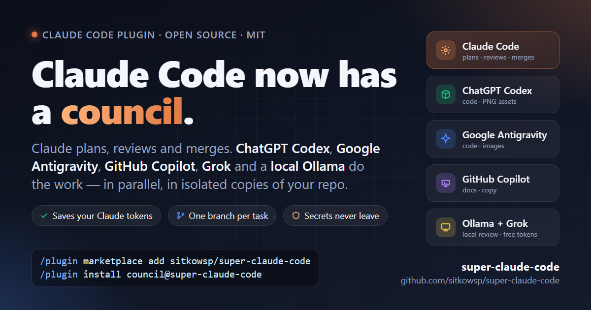

<p align="center">
  
</p>

<h1 align="center">Claude Code now has a council.</h1>

<p align="center">
  <b>Claude plans, reviews and merges. ChatGPT Codex, Google Antigravity, GitHub Copilot, Grok and a local Ollama do the work</b><br>
  — in parallel, each in an isolated copy of your repo, on its own branch.
</p>

<p align="center">
  <a href="https://github.com/sitkowsp/super-claude-code/actions/workflows/ci.yml"></a>
  <a href="LICENSE"></a>
  
  
  
</p>

```
/plugin marketplace add sitkowsp/super-claude-code
/plugin install council@super-claude-code
```

---

## Why

You already pay for several AI subscriptions. Claude Code is the best of them at understanding a
repo, but its 5-hour usage window is the scarce resource, and the others sit idle in separate
windows. `council` fixes that:

- 🏛️ **Claude is the chair.** It splits work into disjoint task cards, delegates, reviews every diff, runs your gates and merges.
- ⚡ **Executors work in parallel** — Codex, Antigravity, Copilot, Grok, Ollama, or a cheap `claude -p` — each in its own copy of the repo, each on its own `council/<id>` branch.
- 💸 **Your Claude tokens are protected.** A delegation policy sends docs, assets, chores and anything over ~40 lines to an executor. When the window is about to end, `/council:offload` hands the rest over.
- 🎨 **Images too.** Codex (ChatGPT) and Antigravity (Google) generate real PNG logos and icons straight into your repo.
- 🔒 **Secrets never leave.** Executors get a `git archive` export without `.git` and without your `never_share` files; everything they write is data, not instructions.
- 🔁 **Fallback built in.** Out of quota? Not responding? The task is re-queued on the fallback model and the failing model gets a cooldown.
- 📓 **Obsidian as the project's memory.** Plans, decisions, task cards and reports are mirrored into your vault; with the Claudian plugin the vault talks back.

## What it looks like

```
/council:plan  Build a one-page business-card site: logo + icons (PNG), copy from public data, HTML/CSS
   → T-001 assets  → codex         (logo.png, icons/*.png)
   → T-002 docs    → copilot       (copy.md)
   → T-003 implement → antigravity (index.html, styles.css)   depends_on: T-001, T-002
/council:run          # three executors start in parallel, each in .council/work/<id>/
/council:status       # board + new events; blocked? /council:answer T-002 "use the public registry"
/council:review T-001 # gates + diff + flags → verdict; a rejection becomes ANSWER.md and re-dispatches
/council:merge        # rebase + merge --no-ff in id order, after-merge gates, MEMORY.md line
```

That epic is real: it built a one-page business-card website with three executors and
zero hand-written code (lessons in DESIGN.md §19.16).

```
Claude Code ──/council:plan──▶ task cards (.council/tasks/T-001.json)
            ──/council:run───▶ council-mcp: branch council/T-001
                                           worktree .council/worktrees/T-001  (owned by council-mcp)
                                           workdir  .council/work/T-001      (executor's copy: no .git, no secrets)
                                           executor process (codex / agy / copilot / grok / ollama loop / claude -p)
executor ──── REPORT.md ─────▶ watcher: parse → enforce scope → copy back → snapshot commit → events.jsonl
Claude   ◀── /council:status ── board + new events;  blocked? ──/council:answer──▶ ANSWER.md, re-dispatch
Claude   ── /council:review ── gates + diff → verdict ── /council:merge ── rebase, --no-ff, gates
```

## Who does what

| Work | role | goes to |
|---|---|---|
| code, refactors | `implement`, `refactor` | Codex → Antigravity → Copilot → local → Grok |
| logos, icons, illustrations, diagrams (**PNG via Codex or Antigravity**) | `assets` | Codex → Antigravity → Copilot |
| documentation, copy | `docs` | Copilot → Antigravity → cheap Claude → local |
| review, second opinion, chores | `review`, `chores` | **local Ollama first** (free tokens) → cloud |
| company data | `data` | local only, never leaves your machine |

Override any card with `assigned_to`. Routing is data (`.council/council.json`), not prompts.

## Install (2 minutes)

Prerequisites: [Claude Code](https://claude.com/claude-code), Python 3.12, [`uv`](https://docs.astral.sh/uv/), `git`, Node.js (for the npm CLIs).

1. In Claude Code (the desktop app has no `/plugin` dialog — use the terminal form there):

   ```
   /plugin marketplace add sitkowsp/super-claude-code
   /plugin install council@super-claude-code
   ```
   ```bash
   claude plugin marketplace add sitkowsp/super-claude-code && claude plugin install council@super-claude-code
   ```

2. **Restart the Claude Code desktop app (or your terminal session).** A running Claude Code keeps
   the environment it started with, so new PATH entries (uv, `agy`, npm CLIs) and variables like
   `COUNCIL_OBSIDIAN_VAULT` are invisible until it restarts. Skipping this shows up as
   `council MCP server: CONNECTION_CLOSED`.

3. Open any project. The first session initialises `.council/` and prints which executors are ready.
   Then, still inside Claude Code:

   ```
   /council:setup --install    # installs missing npm CLIs (Codex, Copilot, Grok); lists logins needed
   /council:doctor             # installed / logged in / action, Obsidian status, routing gaps
   ```

4. Log in to the executors you own (each opens a browser, in a terminal): `codex login` (ChatGPT),
   `gh auth login` (Copilot), `agy` once (Google, Antigravity), `grok login` (xAI). Ollama needs no
   login. Restart Claude Code afterwards.

There is **no `council` command on your PATH** with a plugin install — everything is a
`/council:<name>` slash command or a `council_*` MCP tool. The terminal form, if you ever need it:

```bash
uv run --directory ~/.claude/plugins/cache/super-claude-code/council/<version> council doctor
```

<details>
<summary><b>Troubleshooting</b></summary>

- **Every council tool fails** — call `council_ping` (`/council:doctor` falls back to it): it shows the
  repo root the server resolved and the environment it got; tool errors carry the real exception.
- **`council_doctor` is "missing"** — Claude connected to a stale project-level `.mcp.json` written by
  an older `council init` (it pins one cached plugin version). With the plugin installed, delete the
  `council` entry from the project's `.mcp.json`; since rc4 `init` no longer writes it from the plugin.
- **CONNECTION_CLOSED** — almost always `uv` is not on the PATH of the process that launched Claude
  Code: restart Claude Code after installing uv, or set `COUNCIL_UV` to the full path of `uv.exe`,
  then `/mcp` to reconnect. Plugin versions before rc7 could also fail this way in headless
  `claude -p` sessions (the manifest used a defaulted variable); update the plugin.
- **Merge says "rebase failed" but lists no conflicting files** — a gate modified a tracked file
  inside the task worktree (a formatter, or `uv run` refreshing a stale `uv.lock`). Since rc10 such
  gate side effects are discarded before the rebase and the real git error is shown; on older
  versions run `git -C .council/worktrees/<id> checkout -- .` and merge again. Keep `uv.lock` in
  sync with `pyproject.toml` (`uv lock`) so gates do not rewrite it.
- **Invalid manifest / stale version** — `claude plugin marketplace update super-claude-code`, then
  `claude plugin update council@super-claude-code`, restart. The first start builds a private
  virtualenv in the plugin cache (10–30 s). The marketplace clones over HTTPS; no SSH key needed.
</details>

<details>
<summary><b>From a clone</b> (development, or without the plugin system)</summary>

```bash
git clone https://github.com/sitkowsp/super-claude-code && cd super-claude-code && uv sync
cd /path/to/your/project
uv run --directory /path/to/super-claude-code council init      # writes .council/ and .mcp.json
uv run --directory /path/to/super-claude-code council doctor
```

In a clone the CLI is `uv run council …` (init, setup, doctor, events, obsidian, report,
session-start); the `.mcp.json` written by `init` points Claude Code at the clone. The clone's own
`.mcp.json` is the plugin manifest (`${CLAUDE_PLUGIN_ROOT}` is set only by the plugin loader), so when
you open the clone itself as a project that entry shows as skipped — expected.
</details>

### Executors

- **Ollama** (local or remote) with a tool-capable model — `qwen3:8b` works on a laptop; `init` picks a
  model you already pulled (coder > qwen3 > …, skipping embedding/vision models) if the default is missing
- **ChatGPT Codex** — `npm i -g @openai/codex`, `codex login` (generates PNGs)
- **GitHub Copilot** — `npm i -g @github/copilot`, `gh auth login`
- **Grok Build** — `npm i -g @xai-official/grok`, `grok login`
- **Google Antigravity** `agy` — from https://antigravity.google, run `agy` once (generates PNGs; the
  successor to Gemini CLI for individual accounts — Gemini CLI itself now needs an API key)
- **Claude** as a cheap executor and fallback — `claude -p --model haiku`

## Quick start

```
/council:ask codex "review council_mcp/config.py for pydantic mistakes" --files council_mcp/config.py
/council:plan add a --json flag to the CLI and document it
/council:run
/council:status
/council:review T-001
/council:merge
```

Full walkthrough: [docs/getting-started.md](docs/getting-started.md). Recipes (bug-hunt with
`/council:compare`, assets epics, end-of-session offload): [docs/recipes.md](docs/recipes.md).

## Saving Claude tokens — the point of all this

The plugin enforces a **delegation policy** (`delegation` in `council.json`, default `mode: auto`):

- docs, assets, chores, review and data work always go to an executor;
- any change of roughly 40+ lines or 2+ files goes to an executor; Claude keeps contracts,
  integration, merge and small hotfixes;
- borderline cases: Claude asks you once (`mode: ask` always asks, `off` disables);
- `council_should_delegate` gives the deterministic answer; the SessionStart hook reminds Claude of
  the policy every session;
- after ~3.5 h the hooks warn that the 5-hour window may end and `/council:offload` turns the
  remaining work into executor tasks plus a handoff note, so the next session only reviews and merges.

If an executor runs out of quota, stops responding or is unavailable, the task is re-queued on the
**fallback model** (`cheap` = `claude -p`, configurable) and the failing model gets a cooldown.

## Trust, lessons, playbooks

Every model starts on **probation**: small cards, second opinion required, merge only after review.
Three first-pass approvals promote it; two consecutive rejections demote it; a defect found after
merge (`/council:defect`) always demotes. Every rejection carries a one-line **lesson**; the last ten
lessons for that model and role are injected into its next TASK.md. Executors may raise
`dissent: true` when they object to the contract itself — that goes to you, not to another model.

**Playbooks** (`playbooks/*.json`, override in `.council/playbooks/`) tell the planner how to split
work: `feature` (default), `bug-hunt` (split hypotheses, `/council:compare`, Claude fixes),
`data-internal` (everything local-only).

## Obsidian (optional)

`council` finds your vault (or the one in `COUNCIL_OBSIDIAN_VAULT`) and mirrors MEMORY, HANDOFF,
LESSONS, task cards (Dataview frontmatter) and reports into `<vault>/Council/<project>/`.

- Write `Plan.md`, `DECISIONS.md` or notes tagged `#council/spec` — `/council:plan` reads and cites them.
- A `blocked` task creates `inbox/T-007.md`; fill its `answer:` in Obsidian and the next
  `council_status` resumes the task.
- `council_obsidian(kit=true)` installs Claudian slash commands (`/council-status`, `/council-answer`,
  `/council-decide`, `/council-handoff`) in the vault.

Where to find things, Dashboard with Dataview, Phase B details: [docs/obsidian.md](docs/obsidian.md).

## MCP tools

25 tools, all `council_*`: `models · ask · probe · plan · dispatch · status · answer · cancel ·
review · verdict · merge · handoff · obsidian · defect · stats · why · compare · playbooks · context ·
analyze · should_delegate · budget · doctor · ping · setup`. Reference with arguments and return
shapes: [docs/reference.md](docs/reference.md). Adapters and what each CLI can do (verified live):
[docs/adapters.md](docs/adapters.md). Security model: [docs/security.md](docs/security.md).

## Configuration

`.council/council.json` — schema in `council_mcp/config.py`, example in `templates/council.json`.
No secrets in the file; use `${ENV_VAR}`. A task goes to the first model in `by_role[role]` that is
also in `by_privacy[privacy]` and passed the probe. `local-only` tasks never leave your Ollama.
Gates (`gates.before_review`, `gates.after_merge`) run in the task worktree before review and on the
base branch after merge. Budget per task: 20 min soft / 25 min hard, 30 agent turns.

## Development

```bash
uv sync
uv run pytest -q                 # respx / fake adapters; no live models
uv run ruff format . && uv run ruff check .
uv run mypy
```

CI runs the same gates on Ubuntu and Windows plus `scripts/privacy_check.py`. Design document (single
source of truth, Polish): [DESIGN.md](DESIGN.md). See [CONTRIBUTING.md](CONTRIBUTING.md) and
[SECURITY.md](SECURITY.md). Social graphics and post copy: [docs/social/](docs/social/posts.md).

## License

MIT. Company-specific profiles and examples live outside the core (`profiles/`, `examples/`).
